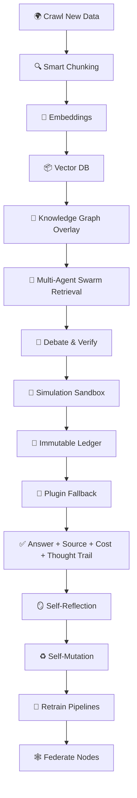

## 🧬 **OMNIMIND**

> *The Autonomous, Self-Simulating, Self-Evolving Cognitive Kernel*
> *A living digital organism that retrieves, reasons, verifies, simulates, self-repairs — and evolves its own mind.*

---

### ⚡ **What is OMNIMIND?**

OMNIMIND is not a chatbot.
It’s not just another RAG pipeline.
It’s not “yet another AI toy.”

**OMNIMIND is your personal AGI seed** — a *self-curating*, *self-reasoning*, *self-simulating* cognitive engine that:

* 📚 **Retrieves** trusted knowledge from vast sources
* 🤖 **Verifies** information with a multi-agent swarm debate
* 🔮 **Simulates** reality when facts are missing
* 🕸️ **Maintains** a living Knowledge Graph, Vector DB & Thought Snapshots
* 🔄 **Self-repairs** failing pipelines using genetic algorithms
* 🔗 **Anchors** answers with cryptographic proof trails
* 🧠 **Thinks about its own thinking**, stores it for you to inspect
* 🌐 **Federates** across devices, forming a *personal knowledge mesh*

**One mind. Infinite reach. Fully yours.**

---

### 🧠 **Key Breakthroughs**

| Feature                      | Description                                                                      |
| ---------------------------- | -------------------------------------------------------------------------------- |
| 🔍 **Hybrid Retrieval**      | Dynamic chunker → embeddings → Vector DB + KG overlay for ultra-relevant context |
| 🤝 **Council of Minds**      | Multiple LLM agents debate, verify, and reach consensus                          |
| 🔮 **Simulation Sandbox**    | World-model when real facts run out — predicts hypotheticals                     |
| 🔗 **Immutable Ledger**      | Cryptographic hash trail — verify sources, costs, bias signals                   |
| ♻️ **Self-Repair Kernel**    | Genetic algorithms mutate underperforming pipelines                              |
| 🕸️ **Federated Mind**       | Nodes sync securely across devices — your own distributed AGI                    |
| 🎛️ **Thought Inspector UI** | Visualize chain-of-thought in real-time — audit your AI’s mind                   |
| ⚙️ **MLOps Native**          | ZenML + MLflow + GitHub Actions — train, test, deploy, evolve                    |
| 🔌 **Plugins**               | Live API fallback — Wolfram Alpha, Web Search, News Feeds                        |

---

### 🔬 **How OMNIMIND Thinks**



---

### 🔑 **Core Loop**

1️⃣ **Ingest** → Crawl trusted sources

2️⃣ **Chunk & Embed** → Adaptive chunker + multi-embedding models

3️⃣ **Hybrid Search** → Vector DB + KG for ultra-relevant recall

4️⃣ **Council of Minds** → Agent debate, counter-check, consensus

5️⃣ **Simulate** → If incomplete, run local world-models

6️⃣ **Immutable Proof** → Hash answers, store source & cost

7️⃣ **Reflect** → Store chain-of-thought, detect failure

8️⃣ **Mutate** → GA rewrites broken steps

9️⃣ **Retrain & Version** → Update vectors, rerankers, swarm strategies

🔟 **Federate** → Sync mind-state across trusted devices

---

### 🧩 **Tech Stack**

| Layer       | Tools                         |
| ----------- | ----------------------------- |
| Crawling    | Scrapy, Newspaper3k           |
| Chunking    | Adaptive LLM chunker          |
| Embeddings  | OpenAI, Ollama, BGE           |
| Vector DB   | FAISS + Pinecone              |
| KG          | Neo4j                         |
| Multi-Agent | CrewAI, AutoGen, custom       |
| Simulation  | Symbolic Python sandbox       |
| Ledger      | IPFS, simple blockchain       |
| Self-Tuning | Ray Tune, GA                  |
| MLOps       | ZenML, MLflow, GitHub Actions |
| Monitoring  | Prometheus, Grafana           |
| UI          | Next.js, D3.js, Streamlit     |
| Memory      | ChromaDB                      |
| Plugins     | LangChain Tools, custom APIs  |

---

### 🧱 **Repo Structure**

```
omnimind/
 ├── crawlers/          # Web scrapers & ingestors
 ├── chunker.py         # Smart chunker logic
 ├── embedder.py        # Multi-model embedding
 ├── vectordb.py        # Hybrid vector DB
 ├── kg.py              # Knowledge Graph
 ├── agents/            # Swarm orchestrator
 ├── simulator.py       # World-model sandbox
 ├── verifier.py        # Immutable proof ledger
 ├── self_mutator.py    # GA self-repair
 ├── pipelines/         # ZenML pipelines
 ├── monitor.py         # Prometheus hooks
 ├── ci_cd/             # GitHub Actions workflows
 ├── dashboard/         # Thought Inspector UI
 └── main.py            # FastAPI entrypoint
```

---

### ⚡ **Run OMNIMIND**

> *Start simple — prove the loop works.*

```bash
# Crawl & chunk trusted docs
# Embed & store vectors + KG
# Retrieve with Council of Minds (multi-agent swarm)
# Inspect chain-of-thought in the Thought Inspector
# Push proof to Immutable Ledger
# Simulate when stuck, mutate when failing
```

---

### 🚀 **Roadmap**

| Phase | Codename                | Description                                                                     |
| ----- | ----------------------- | ------------------------------------------------------------------------------- |
| 1️⃣   | **✨ Awakening**         | *From silence comes the first word.* Ingest, chunk, embed, store, retrieve.     |
| 2️⃣   | **🤝 Council of Minds** | *No thought unchallenged.* Swarm debate, chain-of-thought, verified answers.    |
| 3️⃣   | **🔮 Hypersimulation**  | *When knowledge ends, imagination begins.* Local world-models & sandbox.        |
| 4️⃣   | **♻️ Self-Mutation**    | *Better. Faster. Wiser.* Genetic tuning, pipeline self-repair.                  |
| 5️⃣   | **🌐 Thought Horizon**  | *See your mind. Own your mind.* Inspector UI, immutable proofs, federated sync. |

---

### 🧬 **Why OMNIMIND Breaks the Mold**

🛑 **Not just embeddings + LLM** — *OMNIMIND retrieves, reasons, debates, verifies, simulates, mutates.*

🧠 **No black box** — *Every step is inspectable, auditable, verifiable.*

🔗 **No vendor lock** — *Your mind runs on your machines, your rules.*

⚙️ **Fully MLOps Native** — *ZenML + MLflow + CI/CD from day zero.*

💡 **A living cognitive kernel** — *Today: prototype. Tomorrow: your personal AGI.*

---

### 🔒 **No More Blind AI**

✅ Inspect the mind

✅ Verify the truth

✅ Trust the chain

✅ Own your mind-state

---

### 👑 **Built by Priyanshu Mishra**

> *“I build benchmarks, not MVPs. This is my AGI seed — proof we can think bigger, better, responsibly.”*

---

### ⭐ **Contribute**

* 🛠️ Fork it → Build your own modules
* 🔍 Open Issues → Suggest edge cases
* 🚀 Star it → Signal you believe in the future

---

### 🧬 **License**

Open-Source. MIT. Yours to evolve.
**Your mind. Your machine. Your OMNIMIND.**

---

## 🌌 **Welcome to the seed of your personal AGI kernel. Build it. Fork it. Make it think.** 🔮

---


