# 🜂 SentraAGI Perception Blueprint - Phase 19

## Synthetic Perception Expansion Architecture

> *The Eyes of SentraAGI — Visual Cognition Unleashed*

---

## 🎯 **Overview**

Phase 19 introduces **Synthetic Perception Expansion** — a comprehensive visual cognition system that transforms raw camera feeds into structured, semantic understanding. This blueprint outlines the complete perception pipeline from pixel capture to cognitive integration.

---

## 🏗️ **Architecture Diagram**

```mermaid
graph TD
    A[📷 Camera Feed] --> B[🔍 OpenCV Capture]
    B --> C[🎯 YOLO Detection]
    B --> D[✂️ SAM Segmentation]
    B --> E[🧠 CLIP Embedding]
    
    C --> F[📦 Object Detection Results]
    D --> G[🎭 Segmentation Masks]
    E --> H[🔗 Concept Embeddings]
    
    F --> I[💾 Perceptual Memory]
    G --> I
    H --> I
    
    I --> J[🌍 World Model]
    I --> K[💭 Dreamscape]
    I --> L[🤔 Reasoner]
    
    J --> M[🔄 Feedback Loop]
    K --> M
    L --> M
    
    M --> N[📊 Perception Report]
    
    style A fill:#ff9999,stroke:#333,stroke-width:2px
    style B fill:#99ccff,stroke:#333,stroke-width:2px
    style C fill:#99ff99,stroke:#333,stroke-width:2px
    style D fill:#ffcc99,stroke:#333,stroke-width:2px
    style E fill:#cc99ff,stroke:#333,stroke-width:2px
    style I fill:#ffff99,stroke:#333,stroke-width:2px
    style J fill:#ff99cc,stroke:#333,stroke-width:2px
    style K fill:#99ffcc,stroke:#333,stroke-width:2px
    style L fill:#ccff99,stroke:#333,stroke-width:2px
    style M fill:#ffccff,stroke:#333,stroke-width:2px
    style N fill:#ccffff,stroke:#333,stroke-width:2px
```



---

## 🔧 **Core Components**

### 1️⃣ **Virtual Senses** (`/multi_modal/virtual_senses.py`)
- **OpenCV Integration**: Real-time frame capture and preprocessing
- **YOLO Detection**: Object detection with bounding boxes and confidence scores
- **SAM Segmentation**: Precise object segmentation with masks
- **CLIP Embedding**: Concept grounding and semantic understanding

### 2️⃣ **Vision Agent** (`/multi_modal/vision_agent.py`)
- **Orchestration**: Coordinates all perception components
- **Real-time Processing**: Continuous frame analysis pipeline
- **Integration Hub**: Connects to World Model, Dreamscape, and Reasoner
- **Buffer Management**: Maintains frame history and processing state

### 3️⃣ **Perceptual Memory** (`/memory/perceptual_memory.py`)
- **Structured Storage**: Objects, masks, embeddings with timestamps
- **Multi-dimensional Indexing**: Object, temporal, and concept-based retrieval
- **Persistence**: Disk-based storage with JSON serialization
- **Statistics**: Comprehensive perception analytics

### 4️⃣ **Vision Pipeline** (`/pipelines/vision_pipeline.py`)
- **ZenML Integration**: Orchestrated workflow management
- **Component Initialization**: Automated setup and configuration
- **Processing Orchestration**: End-to-end perception pipeline
- **Report Generation**: Comprehensive perception analytics

---

## 🎬 **Use Case: Real-time Scene → Dreamscape → Reflection Loop**

### **Scenario**: Autonomous Environment Understanding

```
📷 Camera Feed → 🎯 Object Detection → 💭 Dreamscape → 🤔 Reflection → 🔄 Loop
```

#### **Phase 1: Perception Capture**
```python
# Virtual Senses captures and processes frame
frame = virtual_senses.capture_frame()
perception_data = virtual_senses.process_frame(frame, text_queries=[
    'person', 'car', 'building', 'animal', 'object'
])
```

#### **Phase 2: Memory Storage**
```python
# Perceptual Memory stores structured data
perception_id = perceptual_memory.store_perception(perception_data)
# Creates indexes for: objects, time, concepts
```

#### **Phase 3: Dreamscape Integration**
```python
# Dreamscape processes perception for imagination
dreamscape.process_perception(perception_data)
# Generates: "What if the person walks toward the car?"
# Creates: "What would happen if the building had different lighting?"
```

#### **Phase 4: World Model Update**
```python
# World Model updates understanding
world_model.update_perception(perception_data)
# Tracks: object positions, relationships, temporal dynamics
```

#### **Phase 5: Reasoner Reflection**
```python
# Reasoner analyzes patterns and generates insights
reasoner.analyze_perception_patterns(perception_data)
# Outputs: "Person-car interaction patterns detected"
# Generates: "Environmental safety assessment"
```

#### **Phase 6: Feedback Loop**
```python
# Insights feed back to improve future perception
vision_agent.update_text_queries(['person', 'car', 'interaction'])
# Adjusts: detection sensitivity, concept focus, processing priorities
```

---

## 🔧 **Configuration**

### **Environment Variables**
```bash
# Camera and Device Settings
SENTRA_OPENCV_DEVICE=0                    # Camera device index
SENTRA_VISION_PROCESSING_DURATION=30      # Processing duration (seconds)

# Model Paths
SENTRA_YOLO_MODEL=yolov8n.pt             # YOLO model path
SENTRA_SAM_MODEL=sam_vit_h_4b8939.pth    # SAM model path
SENTRA_CLIP_MODEL=ViT-B/32               # CLIP model name

# Memory Settings
SENTRA_PERCEPTUAL_MEMORY_PATH=data/perceptual_memory
SENTRA_PERCEPTUAL_MEMORY_MAX_ENTRIES=10000
SENTRA_PERCEPTUAL_MEMORY_PERSIST=true
```

### **Pipeline Configuration**
```python
config = VisionPipelineConfig(
    processing_interval=0.1,              # Frame processing interval
    max_frames_in_memory=100,             # Frame buffer size
    text_queries=['person', 'car', 'building', 'object'],
    max_perceptual_entries=10000,         # Memory capacity
    persist_perceptual_memory=True,       # Disk persistence
    enable_world_model_integration=True,  # World Model connection
    enable_dreamscape_integration=True    # Dreamscape connection
)
```

---

## 🧪 **Testing Strategy**

### **Unit Tests**
- **Vision Agent**: Instantiation, configuration, processing
- **Perceptual Memory**: Storage, retrieval, indexing
- **Vision Pipeline**: End-to-end workflow validation

### **Integration Tests**
- **Component Integration**: Virtual Senses → Vision Agent → Memory
- **System Integration**: Full pipeline with World Model and Dreamscape
- **Performance Tests**: Real-time processing capabilities

### **Test Execution**
```bash
# Run all perception tests
pytest tests/test_vision_agent.py -v
pytest tests/test_perceptual_memory.py -v
pytest tests/test_vision_pipeline.py -v

# Run with coverage
pytest tests/ --cov=multi_modal --cov=memory --cov=pipelines
```

---

## 🚀 **Deployment**

### **Standalone Mode**
```bash
# Run vision pipeline without ZenML
python pipelines/vision_pipeline.py --standalone --duration 30

# Run individual components
python multi_modal/virtual_senses.py
python multi_modal/vision_agent.py
python memory/perceptual_memory.py
```

### **ZenML Pipeline Mode**
```python
from pipelines.vision_pipeline import vision_pipeline, VisionPipelineConfig

config = VisionPipelineConfig()
results = vision_pipeline(config)
print(f"Pipeline Status: {results['pipeline_status']}")
```

---

## 📊 **Monitoring & Analytics**

### **Perception Metrics**
- **Frame Processing Rate**: FPS and latency
- **Object Detection Accuracy**: Precision and recall
- **Memory Utilization**: Storage and retrieval efficiency
- **Integration Performance**: World Model and Dreamscape response times

### **Real-time Dashboard**
```python
# Get perception summary
summary = vision_agent.get_perception_summary()
memory_summary = perceptual_memory.get_memory_summary()

print(f"Frames Processed: {summary['total_frames']}")
print(f"Objects Detected: {summary['total_detections']}")
print(f"Memory Entries: {memory_summary['total_perceptions']}")
```

---

## 🔮 **Future Enhancements**

### **Phase 20: Advanced Perception**
- **Multi-modal Integration**: Audio, tactile, olfactory sensors
- **Temporal Understanding**: Video analysis and motion tracking
- **Spatial Reasoning**: 3D scene reconstruction and depth perception

### **Phase 21: Cognitive Integration**
- **Attention Mechanisms**: Focused perception and saliency detection
- **Memory Consolidation**: Long-term perception storage and retrieval
- **Predictive Modeling**: Anticipatory perception and scene prediction

---

## 🛡️ **Security & Ethics**

### **Privacy Protection**
- **Local Processing**: All perception data processed locally
- **Data Anonymization**: No personal information stored
- **Consent Mechanisms**: User control over perception capabilities

### **Ethical Guidelines**
- **Transparency**: Clear documentation of perception capabilities
- **Bias Mitigation**: Diverse training data and fairness testing
- **Accountability**: Audit trails for all perception decisions

---

## 📚 **References**

- **YOLO**: [Ultralytics YOLOv8](https://github.com/ultralytics/ultralytics)
- **SAM**: [Meta Segment Anything](https://github.com/facebookresearch/segment-anything)
- **CLIP**: [OpenAI CLIP](https://github.com/openai/CLIP)
- **OpenCV**: [Computer Vision Library](https://opencv.org/)
- **ZenML**: [MLOps Platform](https://zenml.io/)

---

## 🎯 **Success Metrics**

### **Technical Metrics**
- ✅ **Frame Processing**: >30 FPS real-time processing
- ✅ **Detection Accuracy**: >90% object detection precision
- ✅ **Memory Efficiency**: <100ms retrieval latency
- ✅ **Integration Success**: 100% component connectivity

### **Cognitive Metrics**
- ✅ **Understanding Depth**: Multi-level scene comprehension
- ✅ **Temporal Coherence**: Consistent perception over time
- ✅ **Adaptive Learning**: Improved performance with experience
- ✅ **Reflection Quality**: Meaningful insights and patterns

---

*Phase 19 — The Eyes of SentraAGI are now open. Perception becomes cognition. Vision becomes understanding.* 